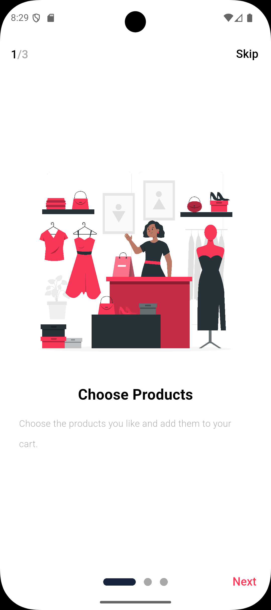
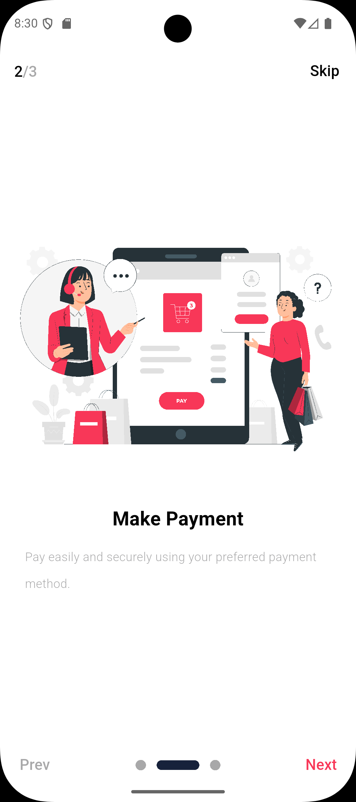
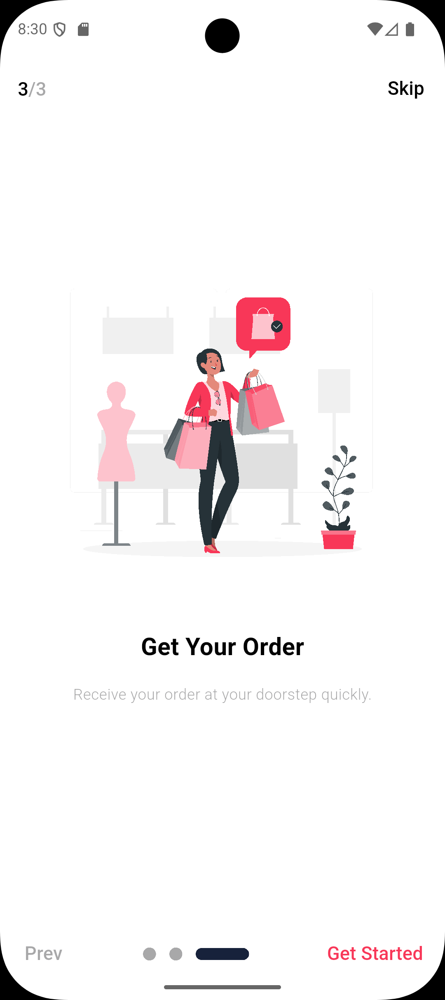
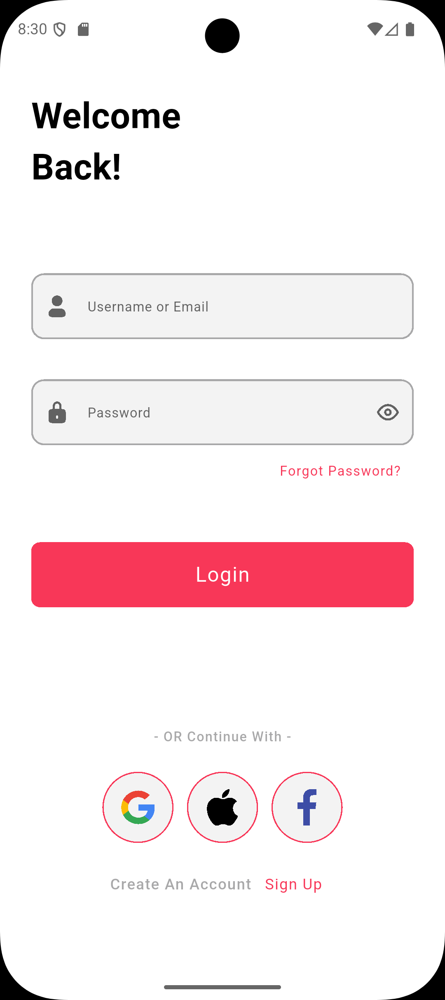
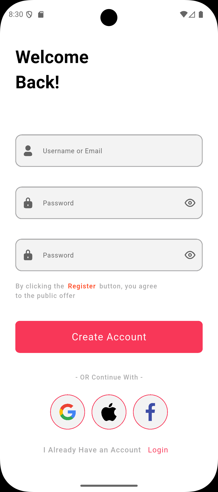

# E-Commerce App 🛒

Welcome to the **E-Commerce App**! This project is a Flutter-based mobile application that provides a full shopping experience. Browse products, add to cart, and manage orders with a clean and modern interface.

---

## Features ✨
- Browse a wide variety of products
- Add products to your cart
- Checkout and manage orders
- User authentication (Login / Register)
- Beautiful and responsive UI
- Easy to extend and customize

---

## Screenshots 📱

|  |  |  |
|------------------------------------------------------|------------------------------------------------------|------------------------------------------------------|
|  |  |  |
| ---                                                  | ---                                                  | ---                                                  |
|  |  |  |

---

## Installation ⚡

1. Clone the repository:

```bash
git clone https://github.com/MohamedMahmoudLashin/E_Commerce.git
